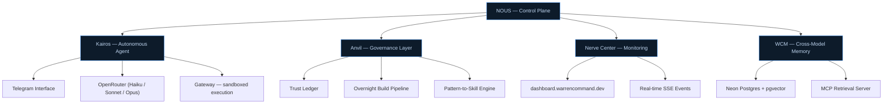

<h3 align="center">Warren Command</h3>

Autonomous AI infrastructure built by one person.

  
  

---

### What this is

A unified system — not a collection of repos — where autonomous agents, governance rules, monitoring, and a control plane all talk to each other. Every component exists because it solves a real problem in running AI infrastructure solo.

The goal: **an always-on intelligence layer that maintains, monitors, and improves itself** while I focus on building the next thing.

---

### System architecture

---

### Components

| System | What it does | Key details |
|--------|-------------|-------------|
| **[NOUS](https://github.com/wtchronos/nous)** | Unified control plane — the kernel that orchestrates everything else | [FastAPI](https://fastapi.tiangolo.com/) on port 8100, progressive trust tiers (T1–T4), single escalation channel |
| **[Kairos](https://github.com/wtchronos/kairos-w)** | Always-on autonomous agent, controlled via [Telegram](https://core.telegram.org/bots/api) | Hash-chained audit trail, 3-tier [OpenRouter](https://openrouter.ai/) LLM routing, 9 [systemd](https://systemd.io/) services, [bubblewrap](https://github.com/containers/bubblewrap) sandboxing |
| **[Anvil](https://github.com/wtchronos/anvil)** | Multi-agent governance — rules, trust, and overnight automation | Shared context bus, trust ledger, overnight pipeline with adaptive learning, pattern-to-skill extraction |
| **[Nerve Center](https://github.com/wtchronos/nerve-center)** | Live monitoring dashboard and active system health monitor | Pure Python [stdlib](https://docs.python.org/3/library/) (zero deps), 51 tests, SSE real-time events, [dashboard.warrencommand.dev](https://dashboard.warrencommand.dev) |
| **[Dashboard](https://github.com/wtchronos/cross-agent-website-dashboard)** | Web frontend — system health visualization, skill map, spend tracking | [React](https://react.dev/) + [TypeScript](https://www.typescriptlang.org/) + [Vite](https://vitejs.dev/) + [tRPC](https://trpc.io/) + [Tailwind CSS](https://tailwindcss.com/) |
| **[Codex Hardening](https://github.com/wtchronos/codex-personal-hardening)** | CI/CD gates, verification policies, cross-agent bridge protocol | Security layer — autonomous skill generation, deployment verification |

---

### How it works in practice

**1. Kairos runs 24/7 on a [DigitalOcean](https://www.digitalocean.com/) VPS.** It polls Telegram for commands, runs scheduled health checks and ambient scans, and surfaces insights proactively. All actions go through a 7-step gateway pipeline with approval gates for anything above low risk.

**2. Anvil enforces the rules.** Every action gets a risk level. Medium and high risk actions require explicit approval via Telegram. The overnight pipeline runs autonomous build loops while I sleep — with trust constraints that prevent it from doing anything destructive.

**3. Nerve Center watches everything.** System health, service uptime, cost tracking, pattern detection. Alerts go to Telegram when something degrades. The [live dashboard](https://dashboard.warrencommand.dev) shows the current state.

**4. NOUS ties it together.** One control plane that shares state across all systems via [Neon Postgres + pgvector](https://neon.tech/). Cross-model memory means context survives across sessions, models, and tools.

---

### Stack

  
  
  
  
  
  
  
  

| Layer | Technologies |
|-------|-------------|
| **Backend** | Python 3.12 ([asyncio](https://docs.python.org/3/library/asyncio.html), [FastAPI](https://fastapi.tiangolo.com/), [Pydantic v2](https://docs.pydantic.dev/)), [httpx](https://www.python-httpx.org/) |
| **Frontend** | TypeScript, [React](https://react.dev/), [Vite](https://vitejs.dev/), [tRPC](https://trpc.io/), [Tailwind CSS](https://tailwindcss.com/), SSE |
| **Infrastructure** | [DigitalOcean](https://www.digitalocean.com/) VPS, [systemd](https://systemd.io/) (10+ services), [Caddy](https://caddyserver.com/) reverse proxy |
| **Data** | [Neon Postgres](https://neon.tech/) + [pgvector](https://github.com/pgvector/pgvector), SQLite, JSONL audit chains |
| **AI/LLM** | [OpenRouter](https://openrouter.ai/) (Haiku/Sonnet/Opus routing), [Claude Code](https://docs.anthropic.com/en/docs/claude-code) (34+ custom skills) |
| **Automation** | [Hammerspoon](https://www.hammerspoon.org/) (Mac), [Telegram Bot API](https://core.telegram.org/bots/api), cron, systemd timers |
| **Security** | [bubblewrap](https://github.com/containers/bubblewrap) sandboxing, HMAC lease management, hash-chained audit logs |

---

### By the numbers

| Metric | Value |
|--------|-------|
| Build sessions | 288+ |
| Avg deliverables per session | 16.5 |
| Systemd services running | 10+ |
| Custom Claude Code skills | 34+ |
| Repos | 9 |
| Team size | 1 |

---

  <a href="https://warrencommand.dev">warrencommand.dev</a>

